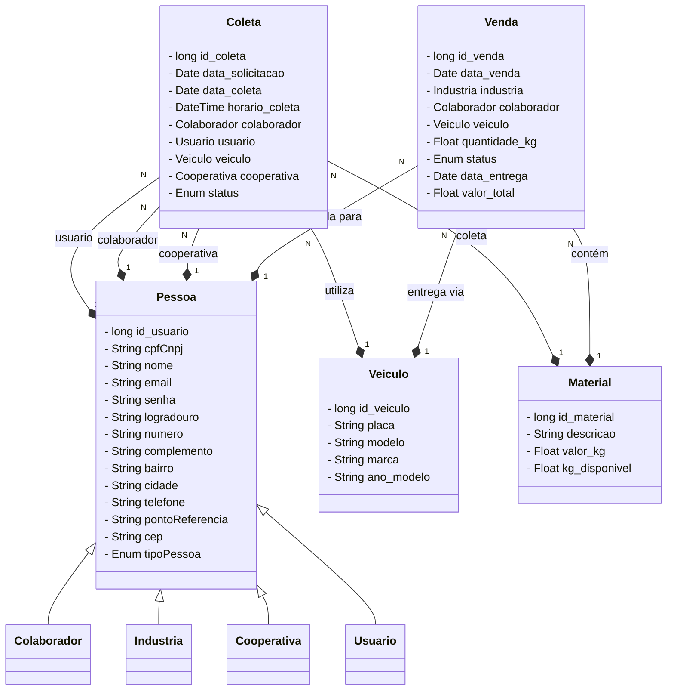

# Projeto Ecoleta -  conectando para uma vida sustentável #

Tecnologia: Spring Boot + Spring Security (Autenticação e Autorização) + Java + MySQL

Objetivo:

 Desenvolver uma solução tecnológica para promover a sustentabilidade ambiental 
por meio do recolhimento eficiente de materiais recicláveis, organização de 
cooperativas de catadores e reintegração de materiais tratados à cadeia produtiva 
como matéria-prima.

Descrição do Projeto:

 O projeto visa criar uma plataforma digital integrada que conecta diferentes agentes 
do ciclo de reciclagem:

1. Coleta Inteligente: Aplicativo para mapear pontos de descarte de materiais 
recicláveis e otimizar a logística de recolhimento por catadores ou cooperativas.
2. Gestão de Cooperativas: Ferramentas para organização e gerenciamento 
de cooperativas de catadores, com controle de entrada/saída de materiais, 
produtividade, pagamentos e treinamentos.
3. Tratamento e Classificação: Registro e monitoramento do processo de triagem 
e tratamento do material coletado, com padronização para reutilização 
industrial.
4. Marketplace Verde: Disponibilização dos materiais tratados em uma 
plataforma online, onde indústrias podem adquirir insumos reciclados para suas 
linhas de produção.

Resultados Esperados:

1. Geração de renda para catadores e fortalecimento das cooperativas
2. Redução do descarte incorreto de resíduos sólidos
3. Estímulo à economia circular e ao consumo consciente nas indústrias
4. Aumento da taxa de reciclagem e reaproveitamento de materiais no Brasil

### Diagrama de Classes ###

