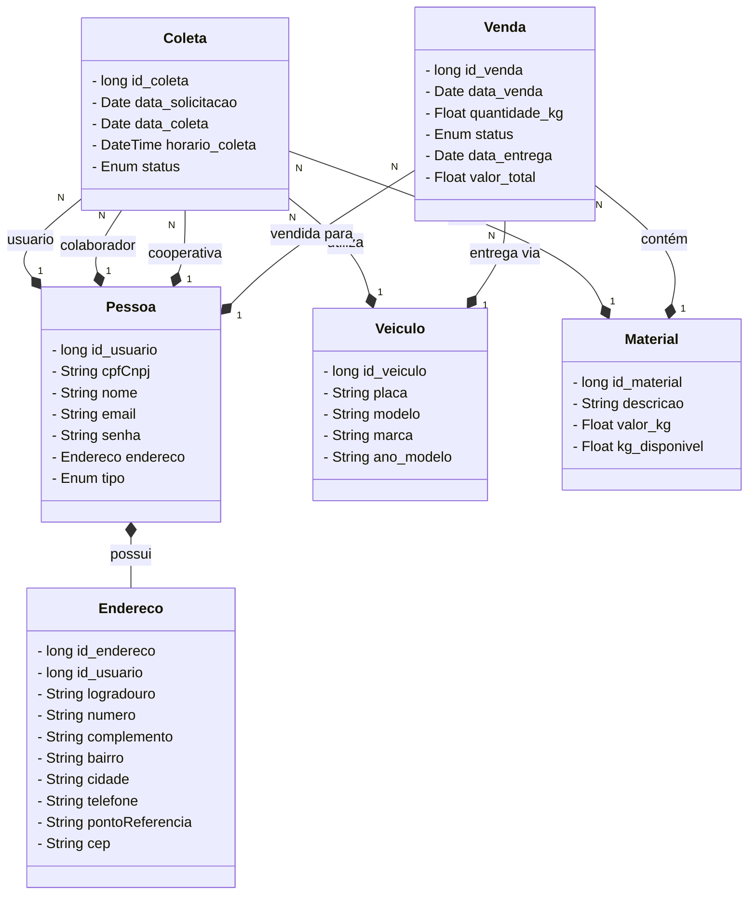

# Projeto Ecoleta -  conectando para uma vida sustentável #

### Diagrama de Classes ###

```mermaid
classDiagram

    class Pessoa {
        - long id_usuario
        - String cpfCnpj
        - String nome
        - String email
        - String senha
        - Endereco endereco
        - Enum tipo
    }

    class Endereco {
        - long id_endereco
        - long id_usuario
        - String logradouro
        - String numero
        - String complemento
        - String bairro
        - String cidade
        - String telefone
        - String pontoReferencia
        - String cep
    }

    class Veiculo {
        - long id_veiculo
        - String placa
        - String modelo
        - String marca
        - String ano_modelo
    }

    class Material {
        - long id_material
        - String descricao
        - Float valor_kg
        - Float kg_disponivel
    }

    class Coleta {
        - long id_coleta
        - Date data_solicitacao
        - Date data_coleta
        - DateTime horario_coleta
        - Enum status
    }

    class Venda {
        - long id_venda
        - Date data_venda
        - Float quantidade_kg
        - Enum status
        - Date data_entrega
        - Float valor_total
    }

   %% Relacionamentos

%% Pessoa -> Endereco (Composição)
Pessoa *-- Endereco : possui

%% Coleta -> Pessoa (usuário, colaborador, cooperativa)
Coleta "N" -- * "1" Pessoa : usuario
Coleta "N" -- * "1" Pessoa : colaborador
Coleta "N" -- * "1" Pessoa : cooperativa

%% Coleta -> Veiculo
Coleta "N" -- * "1" Veiculo : utiliza

%% Coleta -> Material
Coleta "N" -- * "1" Material : coleta

%% Venda -> Material
Venda "N" -- * "1" Material : contém

%% Venda -> Veiculo
Venda "N" -- * "1" Veiculo : entrega via

%% Venda -> Pessoa (industria)
Venda "N" -- * "1" Pessoa : vendida para
```
